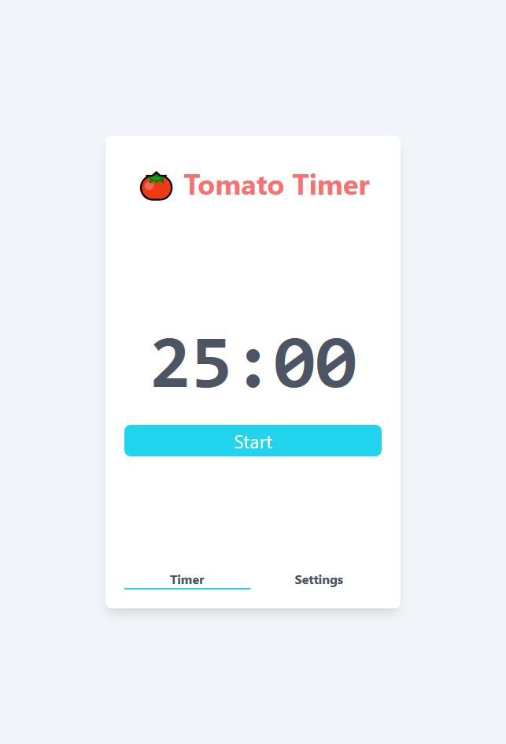
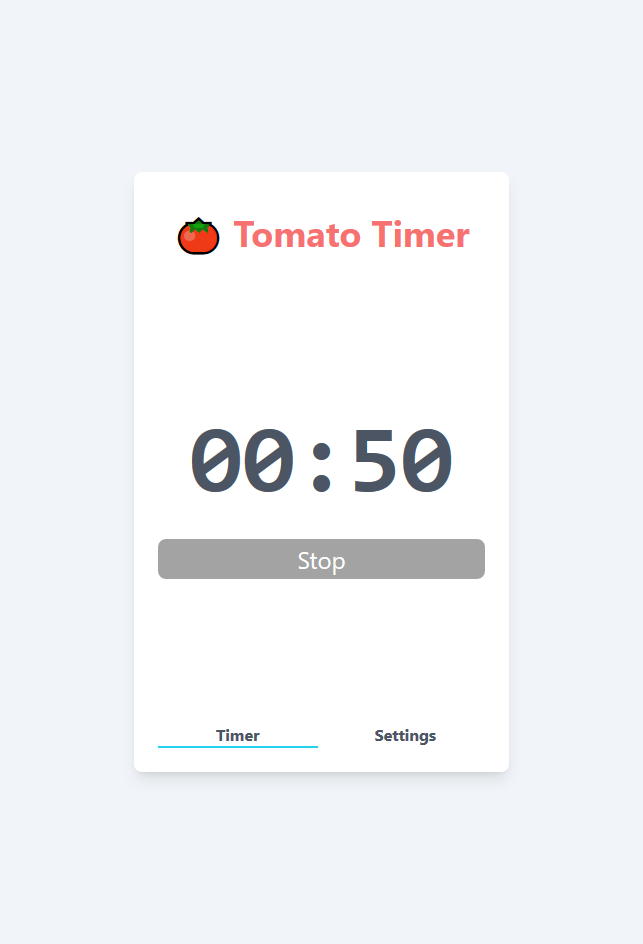
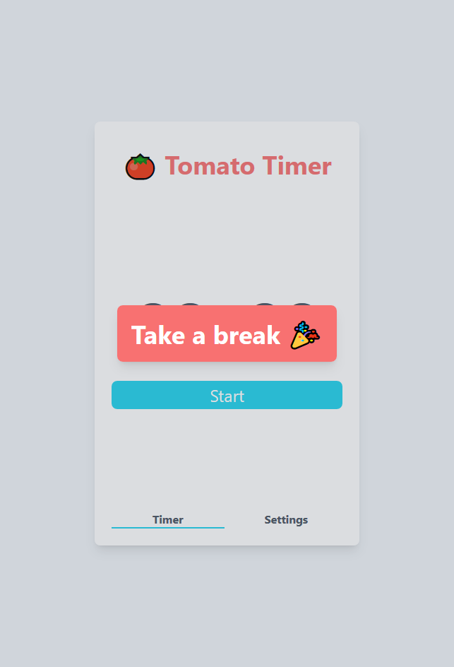
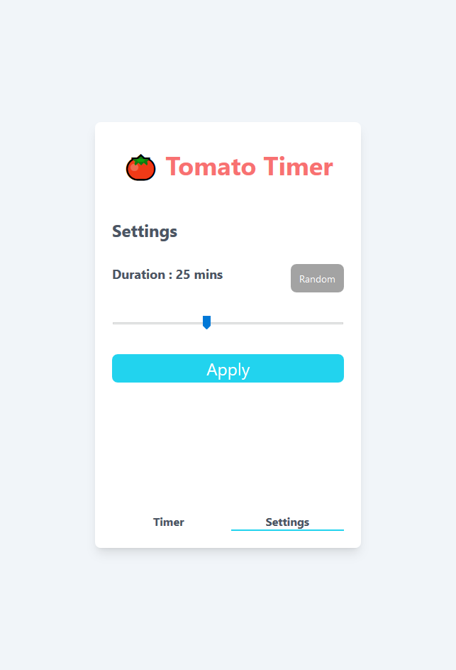

# Tomato Timer in React

The purpose of this project is demonstrate how React supports some key features in web frontend application.

- data binding
- form handling
- routing
- custom component
- fetch external data
- reaction to data change
- client side state
- component styling
- lazy loading
- component testing

You can compare the same application features implemented with [Angular](https://github.com/wilsonleung/timer-angular)

## To run the application

In the project directory, you can run:

1. `npm install`

2. `npm start`

Runs the app in the development mode.\
Open [http://localhost:3000](http://localhost:3000) to view it in the browser.

The page will reload if you make edits.\
You will also see any lint errors in the console.
